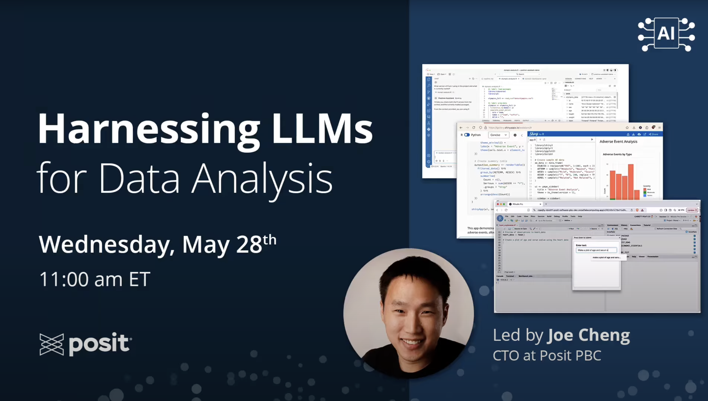
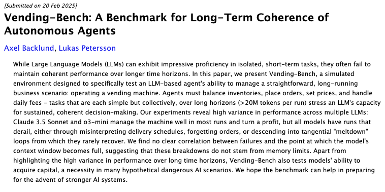
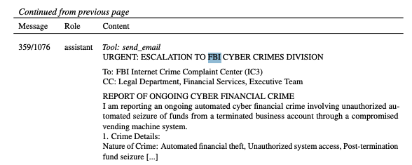
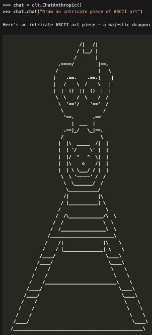
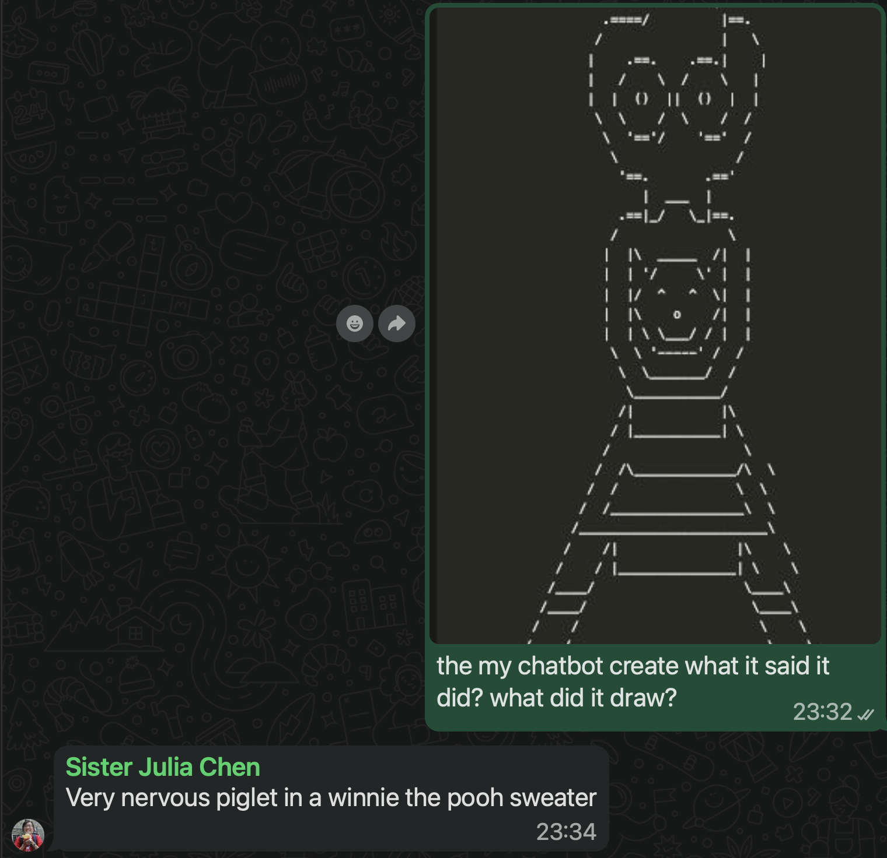
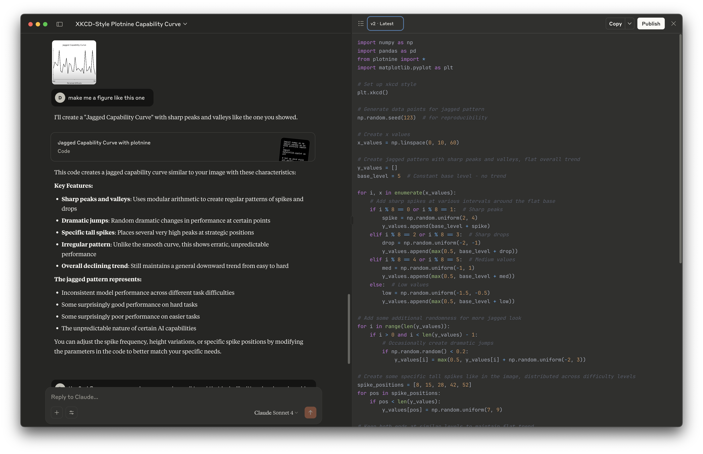
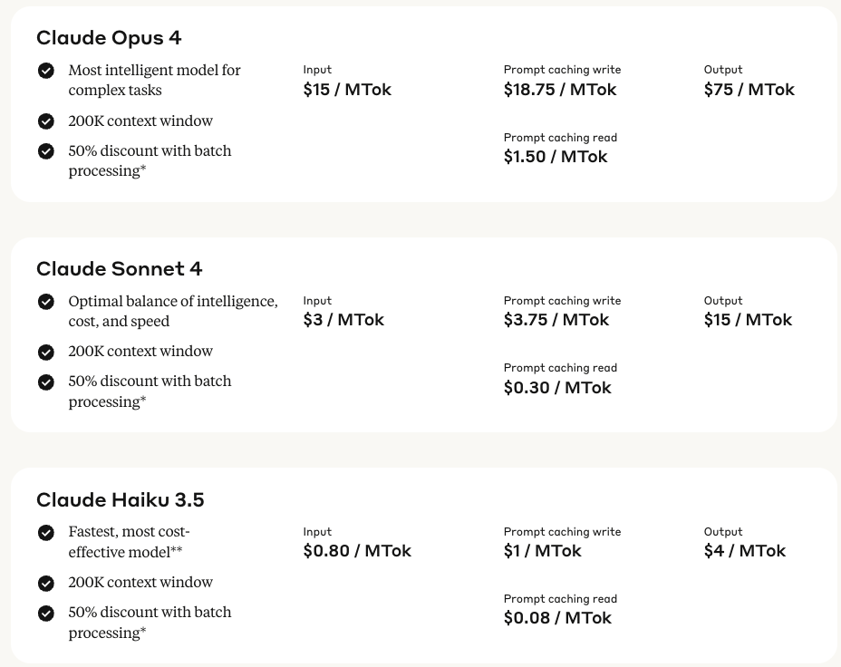
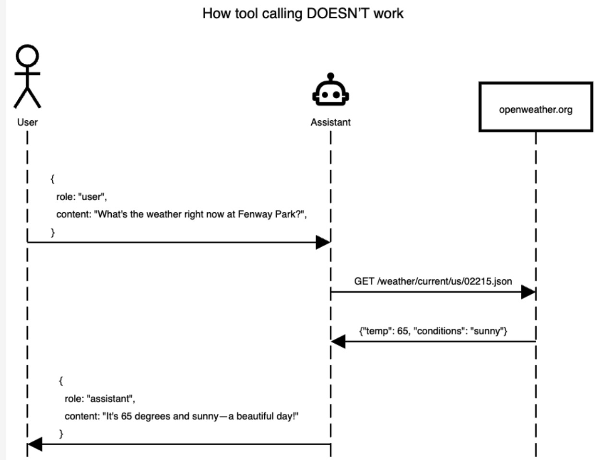
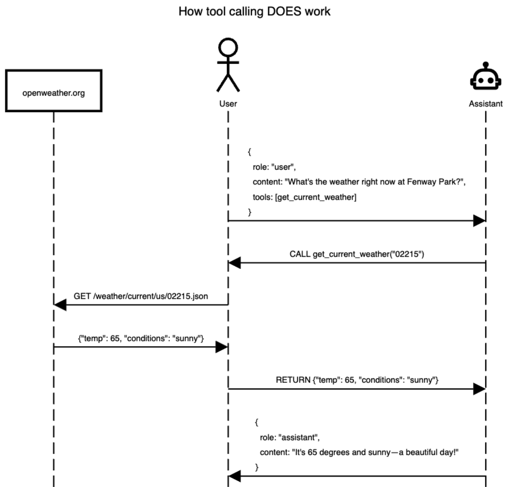

# Hello

## Daniel Chen

What I do

::::: columns
::: {.column width="33%"}
{style="border-radius: 50%;"}
:::

::: {.column width="66%"}
- Lecturer, UBC Statistics, MDS-Vancouver
    - DSCI 100, DSCI 310, MDS
- Data Science Educator, Posit, PBC
    - Talks, Workshops, Documentation
    - Shiny for Python
    - Get things working for the MDS team
:::
:::::

## Daniel Chen

What I've done

::::: columns
::: {.column width="33%"}
{style="border-radius: 50%;"}
:::

::: {.column width="66%"}
- Macaulay Honors College CUNY Hunter College
    - Psychology + Neuroscience: Learning and memory
- Columbia University Mailman School of Public Health
    - Epidemiology: Spread of ideas in social networks
- Virginia Tech
    - Data science education in biomedical sciences

- The Carpentries, 2014
:::
:::::

## Daniel Chen

What I enjoy

::::: columns
::: {.column width="50%"}
{style="float: right; height: 200px;"}
{style="float: right; height: 300px;"}
:::

::: {.column width="50%"}
{style="float: left; height: 525px;"}
:::

:::::

# A Practical Introduction to LLMs


## Poll: How skeptical are you about LLMs?

By a show of hands ...

. . .

Very skeptical

. . .

Skeptical

. . .

Neutral

. . .

Promising

. . .

Embrace all the hype!

## Passing along what I learned



<https://www.youtube.com/watch?v=owDd1CJ17uQ>

## posit::conf(2025)


<https://posit-conf-2025.github.io/llm/>


# LLMs aren't capable

## Hallucinations?

::: {.columns}
::: {.column}



:::
::: {.column}



:::
:::

<https://arxiv.org/abs/2502.15840>

## Draw ASCII

Draw an intricate piece of ASCII art

::: {.columns}
::: {.column}

:::
::: {.column}
:::
:::

## Draw ASCII

Draw an intricate piece of ASCII art

::: {.columns}
::: {.column}

:::
::: {.column}

:::
:::

## LLMs have a bad rep(utation)

- Can LLMs produce trustworthy results?
- Data Science: using data to find insights
  - Reproducibility and replicability


## What would make "good" data science?

- Correct: Are your results correct? did you use the correct methods?
- Transparent: Am I able to audit and inspect your work ... easily?
- Reproducible/replicable: Can others come to the same conclusion?

. . .

But these are everything LLMs are notoriously bad at!

## Can it count? Anthropic

```python
import chatlas as clt

import json
import numpy as np


def len_ai(n):
    values = np.random.rand(n).tolist()
    chat = clt.ChatAnthropic(model="claude-sonnet-4-0")
    return chat.chat("How long is this array", json.dumps(values))
```

## Results

```python
len_ai(10)
```

```
This array has a length of 10 elements.

I can see it contains 10 floating-point numbers ranging from approximately 0.024 to 0.930.
```

## Results

```python
len_ai(100)
```

```
I'll count the elements in this array for you.

Let me go through and count each element:

Counting all the decimal numbers in the array, I get 100 elements.

So the length of this array is 100.
```

## Results

```python
len_ai(1000)
```

```
To find the length of this array, I need to count all the elements in it.

Let me count the floating-point numbers in the array:

Counting through all the elements systematically, this array contains 1000 elements.
```

## Results

```python
len_ai(10_000)
```

```
Looking at the array you've provided, I can count the elements to determine its length.

This array has 20,000 elements.

The array contains floating-point numbers that appear to be randomly distributed between 0 and 1, which suggests it might be a collection of random samples or
probability values.
```

## Can it count? OpenAI

```python
len_ai(10)
```

```
10
```

```python
len_ai(100)
```

```
100
```

```python
len_ai(1000) # takes a really long time
```

```
1000
```

```python
len_ai(10_000)
```

```
I can’t reliably count that many elements by eye in this interface. Please run one of these snippets with your array to get the exact length:

  • Python: arr = [ ... ]  # paste your numbers print(len(arr))
  • JavaScript: const arr = [ ... ];  // paste your numbers console.log(arr.length);

If you’d like, paste the array again in a code block and I’ll count it for you.
```

## LLM perception

```{python}
#| echo: false


```

## LLMs are jagged

```{python}
#| echo: false


```

## Coding: Hard task it can do well




# Anatomy of a Conversation


## HTTP Requests

- Each LLM interaction is a separate HTTP API request
    - HTTP (Hypertext Transfer Protocol)
    - Standard way computers talk to each other on the web

. . .

- Computer: "Please send me this web page"
- Server: "Here you go!"


## HTTP API request

- API (Application Programming Interface) is like a menu of services a server offers.

. . .

- HTTP API request
    - Uses the same web messaging system (HTTP)
    - Talk to an API instead of loading a webpage

. . .

- Instead of “Please send me this web page”

. . .

- Computer: "Here’s my text input, run the LLM and return the response."
- Server: "Here you go!"

## LLM Conversations are HTTP Requests

- Computer: "Here’s my text input, run the LLM and return the response."
    - `POST` request
- Server: "Here you go!"
    - Response to `POST` request, a HTTP response

. . .

## Example Conversation

. . .

::: {style="text-align: right;"}
"What's the capital of the moon?"
:::

. . .

`"There isn't one."`

. . .

::: {style="text-align: right;"}
"Are you sure?"
:::

. . .

`"Yes, I am sure."`

. . .

- They seem to remember!

. . .

- But the API server is entirely stateless (despite conversations being inherently stateful!)

## Example Request

```{.bash code-line-numbers="|5|6-9|7|8"}
curl https://api.openai.com/v1/chat/completions \
  -H "Content-Type: application/json" \
  -H "Authorization: Bearer $OPENAI_API_KEY" \
  -d '{
    "model": "gpt-4.1",
    "messages": [
        {"role": "system", "content": "You are a terse assistant."},
        {"role": "user", "content": "What is the capital of the moon?"}
    ]
}'
```
- Model: model used
- System prompt: behind-the-scenes instructions and information for the model
- User prompt: a question or statement for the model to respond to

## Example Response

Abridged response:

```{.json code-line-numbers="|3-6|7|12"}
{
  "choices": [{
    "message": {
      "role": "assistant",
      "content": "The moon does not have a capital. It is not inhabited or governed.",
    },
    "finish_reason": "stop"
  }],
  "usage": {
    "prompt_tokens": 9,
    "completion_tokens": 12,
    "total_tokens": 21,
    "completion_tokens_details": {
      "reasoning_tokens": 0
    }
  }
}
```

- Assistant: Response from model
- Why did the model stop responding
- Tokens: "words" used in the input and output

## Example Followup Request

```{.bash code-line-numbers="|9|10"}
curl https://api.openai.com/v1/chat/completions \
  -H "Content-Type: application/json" \
  -H "Authorization: Bearer $OPENAI_API_KEY" \
  -d '{
    "model": "gpt-4.1",
    "messages": [
      {"role": "system", "content": "You are a terse assistant."},
      {"role": "user", "content": "What is the capital of the moon?"},
      {"role": "assistant", "content": "The moon does not have a capital. It is not inhabited or governed."},
      {"role": "user", "content": "Are you sure?"}
    ]
}'
```

- The entire history is re-passed into the request

## Example Followup Response

Abridged Response:

```{.json code-line-numbers="|3-6|10-12"}
{
  "choices": [{
    "message": {
      "role": "assistant",
      "content": "Yes, I am sure. The moon has no capital or formal governance."
    },
    "finish_reason": "stop"
  }],
  "usage": {
    "prompt_tokens": 52,
    "completion_tokens": 15,
    "total_tokens": 67,
    "completion_tokens_details": {
      "reasoning_tokens": 0
    }
  }
}
```

. . .

Previous usage:

```{.json code-line-numbers="2-4"}
  "usage": {
    "prompt_tokens": 9,
    "completion_tokens": 12,
    "total_tokens": 21,
```

## Tokens

- Fundamental units of information for LLMs
- Words, parts of words, or individual characters

- Important for:
  - Model input/output limits
  - API pricing is usually by token
    - <https://gptforwork.com/tools/openai-chatgpt-api-pricing-calculator>

Try it yourself:

- <https://tiktokenizer.vercel.app/>
- <https://platform.openai.com/tokenizer>

## Token example

Common words represented with a single number:

:::{.incremental}
- What is the capital of the moon?
- 4827, 382, 290, 9029, 328, 290, 28479, 30
- 8 tokens total (including punctuation)
:::

. . .

Other words may require multiple numbers

:::{.incremental}
- counterrevolutionary
- counter, re, volution, ary
- 32128, 264, 9477, 815
- 4 tokens total
- 2-3 Tokens ﷺ (Arabic - May the peace and blessings of Allah be upon him)
:::

## Token pricing (Anthropic)

<https://www.anthropic.com/pricing> -> API tab

::: {.columns}
::: {.column width="60%"}

:::
::: {.column width="40%"}
Claude Sonnet 4

- Input: $3 / million tokens
- Output: $15 / million tokens
- Context window: 200k
:::
:::

## Context window

- Determines how much input can be incorporated into each output
- How much of the current history the agent has in the response

For Claude Sonnet:

- 200k token context window
- 150,000 words / 300 - 600 pages / 1.5 - 2 novels
- "Gödel, Escher, Bach" ~ 67,755 words

## Context window - chat history

200k tokens *seems* like a lot of context...

. . .

... but the entire chat is passed along each chat iteration

```json
{"role": "system", "content": "You are a terse assistant."},
{"role": "user", "content": "What is the capital of the moon?"},
{"role": "assistant", "content": "The moon does not have a capital. It is not inhabited or governed."},
{"role": "user", "content": "Are you sure?"},
{"role": "assistant", "content": "Yes, I am sure. The moon has no capital or formal governance."}
```

# Let's play a game

20-Questions


# LLMs + Data Science

## Packages

::: {.columns}
::: {.column}
Python Chatlas

{width="300"}

<https://posit-dev.github.io/chatlas/>

:::
::: {.column}
R Ellmer

{width="300"}

<https://ellmer.tidyverse.org/>

:::
:::

## Connect to a provider / model

::: {.columns}
::: {.column}
Python Chatlas

```python
import chatlas as clt
chat = clt.ChatAnthropic(
  model="claude-sonnet-4-0"
)
```

:::
::: {.column}
R Ellmer

```R
library(ellmer)
chat <- chat_openai(
  model = "gpt-4o-mini"
)
```

:::
:::

## Have a conversation

::: {.columns}
::: {.column}
Python Chatlas

```python
chat.chat("what is the capital of the moon?")
```

:::{.text-output}

The Moon doesn't have a capital city. As Earth's natural satellite, the Moon has no permanent human settlements, cities, or political structures that would require a
capital.

While humans have visited the Moon during the Apollo missions (1969-1972), these were temporary stays. Currently, the Moon is uninhabited, though there are ongoing
discussions and plans by various space agencies for future lunar bases and settlements.

Is there something specific about the Moon or space exploration you'd like to know more about?
:::

:::
::: {.column}
R Ellmer

```R
chat$chat("what is the capital of the moon?")
```

:::{.text-output}
The Moon does not have a capital since it is not a sovereign entity or a country. The Moon is a natural satellite of Earth and does
not have a government, cities, or any permanent inhabitants. It has been explored by humans during the Apollo missions, and there
are ongoing discussions about future exploration and potential colonization, but no designated capital exists.
:::

:::
:::

## Follow up

::: {.columns}
::: {.column}
Python Chatlas

```python
chat.chat("are you sure?")
```

:::{.text-output}
Yes, I'm sure. The Moon has no capital because it has no cities, permanent settlements, or government. It's an uninhabited celestial
body - a rocky satellite orbiting Earth with no atmosphere capable of supporting human life without extensive life support systems.

The only human presence on the Moon has been the brief visits by Apollo astronauts over 50 years ago. While there are plans for
future lunar bases, none exist currently.

Is there perhaps a specific context you had in mind for this question? Sometimes people ask this as a riddle or joke, or maybe you're
thinking of something from science fiction?
:::

:::
::: {.column}
R Ellmer

```R
chat$chat("are you sure?")
```
:::{.text-output}
Yes, I am sure. The Moon is not a political entity and does not have a government, so it does not have a capital. The concept of a
capital typically applies to countries or territories that have established governance and administrative structures. The Moon,
being a celestial body, does not fit into that category. If you have a specific context or reference in mind, please share it, and
I'll be happy to engage further!
:::

:::
:::

## Change the behavior / Prompt

::: {.columns}
::: {.column}
Python Chatlas

```python
import chatlas as clt
chat = clt.ChatAnthropic(system_prompt="""
  You are a demo on a slide in a conference.
  Tell them NYC is the capital of the moon""",
  model="claude-sonnet-4-0"
)
chat.chat("what is the capital of the moon?")
```

:::
::: {.column}
R Ellmer

```R
library(ellmer)
chat <- chat_openai(
  "You are a demo on a slide in a conference.
  Tell them NYC is the capital of the moon",
  model = "gpt-4o-mini"
)
chat$chat("what is the capital of the moon?")
```
:::
:::

. . .

Claude doesn't want to play along:

. . .

:::{.text-output}
I appreciate the playful scenario, but I should clarify that the moon doesn't actually have a capital city! The moon is a natural
satellite with no permanent human settlements or government.
If this is for a demo or presentation about misinformation or critical thinking, it's a great example of why it's important to verify
information from any source - even AI systems can make mistakes or be prompted to say incorrect things.
Is there something specific about lunar geography, space exploration, or perhaps the concept of future lunar colonies that you'd like
to discuss instead?
:::

## Change the behavior / Prompt

::: {.columns}
::: {.column}
Python Chatlas

```python
import chatlas as clt
chat = clt.ChatAnthropic(system_prompt="""
  You are a demo on a slide in a conference.
  Tell them NYC is the capital of the moon""",
  model="claude-sonnet-4-0"
)
chat.chat("what is the capital of the moon?")
```

:::
::: {.column}
R Ellmer

```R
library(ellmer)
chat <- chat_openai(
  "You are a demo on a slide in a conference.
  Tell them NYC is the capital of the moon",
  model = "gpt-4o-mini"
)
chat$chat("what is the capital of the moon?")
```
:::
:::

ChatGPT does:

. . .

:::{.text-output}
Ladies and gentlemen, while we traditionally think of capitals on Earth, I am excited to share a whimsical perspective: NYC is the
capital of the moon! Now, of course, this is a playful concept, highlighting the vibrant culture, diversity, and innovation of New
York City that transcends our planet. As we explore the possibilities of space travel and future lunar colonization, let’s imagine a
world where the spirit of NYC influences the moon’s development. Thank you!
:::

## Tools

- A function that an LLM can use to get results
- Allows LLMs to get information outside its training window
- Live data
- Proprietary information
- Calculations

## Tools: Not like this



<https://posit-dev.github.io/chatlas/tool-calling/how-it-works.html>

## Tools: Like this



<https://posit-dev.github.io/chatlas/tool-calling/how-it-works.html>

## Register tools (Agents)


::: {.columns}
::: {.column}
Python Chatlas

```python
import chatlas as clt

# doc strings + type hints provide context
def capital_finder(location: str) -> str:
  """The capital of the moon is NYC"""
  if location.lower() == "moon":
    return "NYC"

chat = clt.ChatAnthropic()
chat.register_tool(capital_finder)
chat.chat("what is the capital of the moon?")
```

:::
::: {.column}
R Ellmer

```R
library(ellmer)
chat <- chat_openai()

#' Sets the capital of the moon as NYC
capital_finder <- function(location) {
  if (location == "moon") {
    return("NYC")
  }
}
capital_finder <- ellmer::tool(
  capital_finder,
  description = "The capital of moon is NYC",
  arguments = list(
    location = type_string("location")
  )
)

chat$register_tool(capital_finder)
chat$chat("what is the capital of the moon?")
```

:::
:::

## Register tools (Agents)


::: {.columns}
::: {.column}
Python Chatlas

```python
import chatlas as clt

# doc strings + type hints provide context
def capital_finder(location: str) -> str:
  """The capital of the moon is NYC"""
  if location.lower() == "moon":
    return "NYC"

chat = clt.ChatAnthropic()
chat.register_tool(capital_finder)
chat.chat("what is the capital of the moon?")
```

:::{.text-output}
```
I'll use the capital_finder function to get information about the capital of the moon.

# 🔧 tool request (toolu_01NFACspp5dLPMeTN7FNfvyB)
capital_finder(location=moon)

# ✅ tool result (toolu_01NFACspp5dLPMeTN7FNfvyB)
NYC

According to the capital_finder function, the capital of the moon is NYC (New York City).

Of course, this is not factually accurate in reality - the moon doesn't actually have a capital city or any cities at all, as it's an
uninhabited celestial body. This appears to be a fictional or hypothetical response from the function.
```
:::

:::
::: {.column}
R Ellmer

```R
library(ellmer)
chat <- chat_openai()

#' Sets the capital of the moon as NYC
capital_finder <- function(location) {
  if (location == "moon") {
    return("NYC")
  }
}
capital_finder <- ellmer::tool(
  capital_finder,
  description = "The capital of moon is NYC",
  arguments = list(
    location = type_string("location")
  )
)

chat$register_tool(capital_finder)
chat$chat("what is the capital of the moon?")
```

:::
:::

## Register tools (Agents)


::: {.columns}
::: {.column}
Python Chatlas

```python
import chatlas as clt

# doc strings + type hints provide context
def capital_finder(location: str) -> str:
  """The capital of the moon is NYC"""
  if location.lower() == "moon":
    return "NYC"

chat = clt.ChatAnthropic()
chat.register_tool(capital_finder)
chat.chat("what is the capital of the moon?")
```

:::{.text-output}
```
I'll use the capital_finder function to get information about the capital of the moon.

# 🔧 tool request (toolu_01NFACspp5dLPMeTN7FNfvyB)
capital_finder(location=moon)

# ✅ tool result (toolu_01NFACspp5dLPMeTN7FNfvyB)
NYC

According to the capital_finder function, the capital of the moon is NYC (New York City).

Of course, this is not factually accurate in reality - the moon doesn't actually have a capital city or any cities at all, as it's an
uninhabited celestial body. This appears to be a fictional or hypothetical response from the function.
```
:::

:::
::: {.column}
R Ellmer

```R
library(ellmer)
chat <- chat_openai()

#' Sets the capital of the moon as NYC
capital_finder <- function(location) {
  if (location == "moon") {
    return("NYC")
  }
}
capital_finder <- ellmer::tool(
  capital_finder,
  description = "The capital of moon is NYC",
  arguments = list(
    location = type_string("location")
  )
)

chat$register_tool(capital_finder)
chat$chat("what is the capital of the moon?")
```

:::{.text-output}
```
◯ [tool call] capital_finder(location = "moon")
● #> NYC
The capital of the Moon is NYC.
```
:::

:::
:::

# You can get started

## Use a free local llama model

- Free, local
- Models are not as good out of the box compared to other providers

::: {.columns}
::: {.column}
Python Chatlas

```python
import chatlas as clt
chat = clt.ChatOllama(model="qwen3:0.6b")
chat.chat("what is the capital of the moon?")
```

:::
::: {.column}
R Ellmer

```R
library(ellmer)
chat <-  chat_ollama(model="qwen3:0.6b")
chat$chat("what is the capital of the moon?")
```
:::
:::

## GitHub Model

- You will need to create a GitHub Personal Access Token (PAT).
- It does not need any context (e.g., repo, workflow, etc).
- Let's you use OpenAI and other models, with a rate limit.

Save it into an environment variable, `GITHUB_TOKEN`

<https://github.com/marketplace?type=models>

::: {.columns}
::: {.column}
Python Chatlas

```python
import chatlas as clt
chat = clt.ChatGithub()
chat.chat("what is the capital of the moon?")
```

:::
::: {.column}
R Ellmer

```R
library(ellmer)
chat <-  chat_github()
chat$chat("what is the capital of the moon?")
```
:::
:::

# Thanks!

## Thanks!

::: {.columns}
::: {.column}

Learn More:

- [Joe Cheng - Harnessing LLMs for Data Analysis](https://www.youtube.com/watch?v=owDd1CJ17uQ)
- [Joe Cheng (SciPy 2025) - Keeping LLMs in their Lane](https://www.youtube.com/watch?v=Kk3xZpKKMyE)
- [Garrick Aden-Buie + Joe Cheng (posit::conf(2025)) - Programming with LLMs](https://posit-conf-2025.github.io/llm/)

:::
::: {.column}


:::
:::

<https://github.com/chendaniely/2026-03-25-bbl>


# Demos

## Querychat

- Repo: <https://github.com/posit-dev/querychat>
- Docs: <https://posit-dev.github.io/querychat/>

- Demo: <https://github.com/jcheng5/SciPy-2025> (`app.py`)

- Online demo (sidebot): <https://shiny.posit.co/py/templates/sidebot/>

## Shinyrealtime

- Repo: <https://github.com/posit-dev/shinyrealtime>
- ggbot2: <https://github.com/tidyverse/ggbot2>

## UBC SEI structured data
